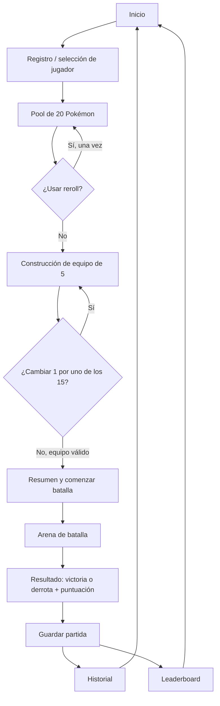
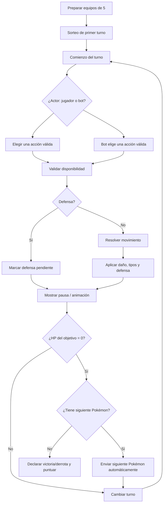

# Documento maestro — Card Battle Arena: Pokémon

**Proyecto integrador · Fuente de verdad de trabajo**  
**Equipo:** Manuel y Jose  
**Estado:** base funcional y de diseño acordada antes del desarrollo  
**Versión:** 2.0 · 14 de agosto de 2026

> Este documento separa deliberadamente tres niveles: **[P]** requisito indicado como obligatorio por el profesor/enunciado; **[E]** decisión propia ya tomada por el equipo; y **[X]** extra o idea opcional. No se debe tratar un punto [E] o [X] como requisito de evaluación. Cuando el enunciado no precisa un detalle necesario para programar, se marca como pendiente en vez de inventarlo.

## 0. Rectificación vinculante contra el enunciado del profesor

La versión 1.x se redactó sin acceso al enunciado completo. Desde la versión 2.0, este bloque **prevalece sobre cualquier afirmación anterior en conflicto** y debe usarse para evaluar cumplimiento.

| Tema | Regla vinculante | Clasificación |
|---|---|---|
| Cartas iniciales | Deben existir 20 cartas precargadas en `src/data/db.json`; la partida requiere al menos 10 cartas activas. | [P] |
| Pokémon Gen 1 | Usar los 151 Pokémon como catálogo ampliado es una decisión del equipo; no es una obligación literal del enunciado. | [E] |
| Reroll y cambio único | Son mejoras propias y no reemplazan la selección obligatoria de cinco cartas diferentes. | [E] |
| Orden del equipo | Debe poder definirse mediante un mecanismo funcional; Drag & Drop es una opción, no obligación. | [P]/[E] |
| Máquina | Elige cinco cartas no seleccionadas por el jugador y toma una acción válida automáticamente; no se exige IA real. | [P] |
| Especial | Se habilita desde el segundo turno propio, hace más daño que un ataque normal y tiene cooldown de tres turnos propios. La regla previa de tercer turno queda descartada para cumplir el enunciado. | [P] |
| Puntuación | Victoria: +50; derrota: +10. También se actualizan victorias, derrotas y partidas jugadas. La fórmula previa queda descartada. | [P] |
| CRUD | Es obligatorio para **cartas**, en administración protegida por login; se deben demostrar GET, POST, PUT, PATCH y DELETE mediante Fetch API. El CRUD de jugadores es opcional. | [P] |
| Administración | Login sencillo contra `admins` precargados en `db.json`; solo habilita el panel tras validación por API. | [P] |
| Tecnologías | HTML, CSS, JavaScript Vanilla, ES Modules, Web Components y Fetch API. Tailwind está permitido por autorización verbal docente solo como apoyo visual; no se permiten frameworks frontend ni Axios. | [P] |
| Entrega | Recursos de imagen/audio, animaciones CSS, `.env`, README, Git/GitHub y frontend publicado son requisitos de entrega. | [P] |

## 1. Propósito y concepto

**Card Battle Arena — Pokémon** es una aplicación web de combate por turnos inspirada en Pokémon de primera generación. La persona jugadora construye un equipo a partir de cartas, se enfrenta a un bot y consulta los resultados de sus partidas. El proyecto integra interfaz interactiva, reglas de batalla, consumo de una API REST, persistencia y operaciones CRUD.

El objetivo del equipo es entregar una experiencia clara y funcional: elegir cartas, armar equipo mediante arrastrar y soltar, combatir con reglas consistentes y conservar/consultar datos de partidas y puntuaciones.

## 2. Alcance y criterios de prioridad

| Prioridad | Incluye | Regla de decisión |
|---|---|---|
| Obligatoria | Todos los elementos marcados [P] | Deben estar completos, comprobables y funcionando antes de dedicar tiempo a extras. |
| Acordada por el equipo | Todos los elementos [E] | Forman la especificación operativa actual; cambiar uno exige actualizar este documento. |
| Opcional | Todos los elementos [X] | Solo se implementan si no ponen en riesgo requisitos [P] ni decisiones [E]. |

Fuera de alcance por ahora: modos multijugador en línea, Pokémon posteriores a la primera generación, economía/tienda, evolución, objetos, estados alterados complejos y reglas competitivas completas de Pokémon. Incluirlos sin tiempo disponible puede comprometer la entrega.

## 3. Requisitos obligatorios del profesor [P]

Los siguientes puntos se registran como requisitos del enunciado de acuerdo con la información disponible para este documento. Su implementación no depende de los extras.

### 3.1 Catálogo, selección y equipo

- [P] Trabajar con los **151 Pokémon de la Generación 1**.
- [P] Presentar un **pool inicial de 20 Pokémon** para la elección de la persona jugadora.
- [P] Permitir **un único reroll** del pool de 20.
- [P] Permitir seleccionar **5 Pokémon** para formar el equipo.
- [P] Permitir cambiar **1 Pokémon seleccionado** por uno de los **15 restantes** del pool activo.
- [P] Implementar la construcción/organización del equipo mediante **Drag & Drop**.
- [P] El bot debe realizar una **selección inteligente** para su equipo; no debe limitarse a escoger cinco opciones puramente al azar.
- [P] Usar cartas de presentación compacta para los Pokémon.

### 3.2 Combate y reglas base

- [P] Implementar un sistema de tipos basado en la **Generación 1**.
- [P] Usar ataques reales de Pokémon.
- [P] Cada Pokémon dispone de **4 movimientos** y **1 movimiento especial**.
- [P] Cada Pokémon inicia con **250 HP**.
- [P] Los daños base de los cuatro movimientos son **20, 30, 40 y 50**, con una variación aleatoria de **0.85 a 1.15**.
- [P] Aplicar efectividad por tipos con multiplicadores **×2, ×1, ×0.5 y ×0**, incluidas las inmunidades.
- [P] Incluir defensa: reduce en **50 %** el siguiente daño recibido.
- [P] Incluir movimiento especial con desbloqueo y cooldown según la regla establecida para el proyecto.
- [P] Resolver el combate por turnos y ejecutar únicamente acciones válidas.
- [P] Al caer un Pokémon, realizar el cambio al siguiente Pokémon disponible; si no quedan Pokémon, finalizar el combate.
- [P] Registrar victoria/derrota y puntuación.

### 3.3 Aplicación, datos e integración técnica

- [P] Incluir **leaderboard** y **historial** de partidas.
- [P] Implementar operaciones **CRUD** sobre los recursos definidos por el proyecto.
- [P] Consumir los datos mediante **Fetch API**.
- [P] Construir componentes de interfaz con **Web Components**.
- [P] Exponer/consumir una **API REST** y asegurar **persistencia** de los datos requeridos.

## 4. Decisiones propias del equipo [E]

### 4.1 Experiencia de selección

- [E] El pool se genera a partir de los 151 Pokémon Gen 1 sin duplicados dentro del mismo pool.
- [E] El reroll sustituye por completo el pool actual y solo puede ejecutarse una vez por preparación de partida. Después de usarlo, no se puede recuperar el pool anterior.
- [E] Tras elegir cinco cartas, quedan quince cartas elegibles en el mismo pool. El cambio permite retirar una de las cinco y reemplazarla por exactamente una de esas quince; la carta retirada vuelve a los quince restantes.
- [E] La selección no puede continuar a batalla si el equipo no tiene exactamente cinco Pokémon.
- [E] El Drag & Drop debe tener alternativa accesible con controles de selección/mover, para no depender exclusivamente del arrastre.
- [E] Las cartas compactas muestran, como mínimo, imagen o representación, nombre, número de Pokédex, tipo(s), HP y una señal de los movimientos disponibles; el detalle completo puede abrirse sin saturar el grid.
- [E] Una vez que el jugador confirma sus cinco Pokémon y agota o descarta el único cambio permitido, el bot elige sus cinco solo de las quince cartas restantes del mismo pool. No hay Pokémon duplicados entre los equipos.
- [E] La selección inteligente del bot valora cobertura de tipos y reduce debilidades repetidas dentro de su propio equipo. No puede analizar el equipo del jugador para escoger counters directos. Como desempate puede usar aleatoriedad controlada.
- [E] El equipo del bot se revela progresivamente: solo se muestra su Pokémon activo al entrar en combate, no las cinco cartas desde el inicio.

### 4.2 Modelo de batalla

- [E] El primer turno se decide al azar al iniciar cada combate.
- [E] En cada turno, el actor activo realiza una única acción válida: uno de sus cuatro ataques, defensa o especial si está disponible. La acción termina el turno.
- [E] Se puede usar cualquier ataque aunque sea poco efectivo o resulte inmune; el ataque se ejecuta, pero puede infligir poco o ningún daño según la tabla de tipos.
- [E] La defensa puede usarse en turnos consecutivos. Cada uso deja una defensa pendiente que reduce en 50 % **el siguiente daño recibido**; se consume después de que ese daño se procese. No se acumula por encima de una defensa pendiente.
- [E] El especial está bloqueado durante los dos primeros turnos propios de ese Pokémon: en su turno propio 1 y 2 no se puede usar; queda disponible al terminar el turno propio 2 y, por tanto, puede elegirse desde el turno propio 3.
- [E] Después de usar el especial, el cooldown dura tres turnos propios completos: no está disponible en los siguientes tres turnos propios y vuelve a estar disponible en el cuarto. El contador pertenece al Pokémon activo, no al turno global.
- [E] Los contadores del especial y la defensa pertenecen al Pokémon individual. Al cambiar de Pokémon no se transfieren al relevo; al regresar, ese Pokémon conserva su propio estado de combate.
- [E] Después de mostrar una acción y antes de la siguiente, la interfaz incluye una pausa breve/animación para que el combate se perciba como una secuencia y no como un cambio instantáneo.

### 4.3 Fórmula y orden de resolución

Para un movimiento ofensivo normal, la resolución acordada es:

```text
daño preliminar = dañoBase × factorAleatorio(0.85–1.15) × efectividadPorTipos
daño recibido   = redondeo(daño preliminar × modificadorDeDefensa)
HP final        = máximo(0, HP actual − daño recibido)
```

- [E] `modificadorDeDefensa` es `0.5` si el objetivo tiene defensa pendiente; en cualquier otro caso es `1`.
- [E] Una inmunidad (×0) produce daño 0 y no elimina la defensa pendiente, porque no se recibió daño.
- [E] El redondeo se debe aplicar una sola vez, al final de la fórmula. La función elegida es `Math.round`.
- [E] Se usan los cuatro daños base 20, 30, 40 y 50, uno para cada movimiento normal. Los nombres y tipos de los movimientos deben corresponder a ataques reales; no se alteran sus nombres para fingir ataques inexistentes.
- [E] El daño, la efectividad y el estado de defensa deben verse en el registro de batalla de modo comprensible.

### 4.4 Especial, puntuación, relevo y movimientos

- [E] El especial es un movimiento real de Generación 1 asignado al Pokémon. Tiene un **daño base de 70** y usa exactamente la misma fórmula de variación, efectividad por tipos, inmunidades, defensa y redondeo que un movimiento normal.
- [E] El especial no ignora defensa ni tiene precisión, crítico, estados alterados o efectos secundarios adicionales. Su valor táctico proviene de su daño base y de su ventana de uso/cooldown.
- [E] Al terminar una batalla, la persona jugadora recibe **100 puntos por victoria** y **0 puntos por derrota**. Además, por cada Pokémon propio que siga con HP mayor a 0 al ganar, recibe **20 puntos adicionales**. La puntuación final de una victoria queda entre 120 y 200 puntos; la derrota registra puntuación 0.
- [E] El leaderboard ordena por puntuación acumulada descendente. En empate, prioriza mayor número de victorias y, si persiste, la partida más reciente.
- [E] El orden definido mediante Drag & Drop es el orden de combate. Cuando un Pokémon cae, entra automáticamente el primer Pokémon vivo posterior en ese orden; no se abre una selección de relevo durante la batalla.
- [E] Los movimientos se almacenan en un catálogo propio y persistente del proyecto. Se seleccionan de los movimientos que el Pokémon podía aprender en Generación 1 por nivel, MT/MO o tutor/evento si la fuente elegida lo documenta. PokeAPI puede utilizarse para verificar/sembrar los datos, pero la partida nunca depende de una llamada externa en tiempo real.
- [E] Cada Pokémon recibe cuatro movimientos normales de tipo y nombres reales, más un especial real. Los daños base asignados por el juego (20/30/40/50/70) son reglas de Card Battle Arena y no pretenden reproducir el poder original del movimiento en los juegos de Pokémon.

### 4.5 Tabla de tipos Gen 1

- [E] Se manejarán los 15 tipos de la Generación 1: Normal, Fuego, Agua, Eléctrico, Planta, Hielo, Lucha, Veneno, Tierra, Volador, Psíquico, Bicho, Roca, Fantasma y Dragón.
- [E] La matriz de efectividad debe representar reglas de **Generación 1**, no la tabla moderna. Debe implementarse como datos centralizados y probarse, en especial, cada inmunidad.
- [E] Para Pokémon de doble tipo, se multiplican los modificadores de ambos tipos defensivos y el resultado se limita a los valores que realmente produzca la combinación. La UI puede comunicar ×4 o ×0.25 si aparece; esto no contradice los multiplicadores base por relación de tipo (×2, ×1, ×0.5, ×0).
- [E] La fuente canónica para implementar y probar la matriz es la tabla histórica de Pokémon Database: <https://pokemondb.net/type/old>. Cualquier discrepancia se resuelve a favor de esa referencia documentada y se registra como cambio de versión.

### 4.6 Arquitectura funcional mínima

- [E] La API REST es la única vía de lectura/escritura persistente desde el cliente; la UI no debe depender de datos duplicados manualmente en varios componentes.
- [E] Los Web Components se diseñan con una responsabilidad clara. Candidatos: `pokemon-card`, `pokemon-pool`, `team-builder`, `battle-arena`, `battle-log`, `leaderboard-view` e `match-history`.
- [E] Recursos REST mínimos sugeridos: `pokemon`, `players`, `matches` y `leaderboard` (este último puede ser una vista derivada de partidas). Las rutas exactas se decidirán al definir el contrato.
- [E] El historial conserva, como mínimo, fecha, jugador, resultado, puntuación obtenida y resumen de equipos. El leaderboard se calcula/actualiza desde datos persistidos, no únicamente en memoria de la pantalla actual.
- [E] Se adopta una estrategia híbrida de datos: PokeAPI se usa para consultar, sembrar y verificar datos de referencia; la API propia conserva el catálogo necesario y atiende al cliente durante la partida. La aplicación no depende de llamadas a PokeAPI en tiempo real para jugar.
- [E] Las cartas usan sprites compactos de los recursos de PokeAPI o equivalentes permitidos. Los recursos se guardan o referencian de forma estable según el despliegue, con atribución cuando corresponda.
- [E] El proyecto usa un conjunto pequeño de efectos sonoros reutilizables y permitidos (por ejemplo: ataque, defensa, KO, victoria y derrota); no almacenará sonidos individuales para los 151 Pokémon.
- [E] El CRUD completo se implementa sobre `players`: crear, consultar, editar nombre y eliminar. `pokemon` es un catálogo de solo lectura; `matches` se crea y consulta, pero no se edita ni elimina desde la interfaz; `leaderboard` es de solo lectura y se deriva de las partidas persistidas.
- [E] No hay cuentas, contraseñas ni sesiones. Al iniciar, la persona escribe un alias único y elige un perfil existente o crea uno. La API guarda un identificador interno para relacionar de manera estable el perfil, las partidas y la puntuación; el alias es el nombre visible y puede editarse mediante el CRUD de jugadores.

## 5. Extras e ideas que no deben comprometer requisitos [X]

- [X] Animaciones de ataque, sacudida de carta y transición de KO más elaboradas.
- [X] Sonidos, música, efectos de impacto y opción de silenciar.
- [X] Filtros, búsqueda y ordenamiento del catálogo/pool.
- [X] Vista expandida de estadísticas, debilidades y cobertura del equipo.
- [X] Indicadores visuales de efectividad, cooldown y defensa pendiente.
- [X] Temas visuales, modo oscuro, logros y tarjetas de resumen para compartir.
- [X] Repetición detallada de combates o exportación de historial.

## 6. Flujo completo de pantallas



### Detalle por pantalla

1. **Inicio / jugador.** Identifica o crea el jugador según el CRUD definido. Ofrece acceso a nueva partida, historial y leaderboard.
2. **Pool de 20.** Muestra las veinte cartas compactas, el estado del reroll y la información de selección.
3. **Constructor de equipo.** Permite arrastrar/soltar o usar controles equivalentes para dejar exactamente cinco cartas. Muestra las quince restantes y permite un solo cambio.
4. **Resumen previo.** Confirma equipo propio y del bot (al menos cuando corresponda a la experiencia elegida), e inicia el sorteo del primer turno.
5. **Arena.** Muestra Pokémon activos, HP, orden de equipo, acciones disponibles, estado de defensa/especial y registro de batalla.
6. **Resultado.** Indica victoria o derrota, puntuación y un resumen de la partida. Persiste la partida antes de llevar a historial/leaderboard.
7. **Historial y leaderboard.** Permiten consultar información persistida; las operaciones CRUD aplicables deben estar disponibles en la experiencia definida.

## 7. Flujo de batalla



### Secuencia operativa de un turno

1. Se identifica el actor activo y se habilitan solo sus acciones válidas.
2. Jugador o bot elige una acción.
3. Si es defensa, se marca su efecto pendiente. Si es movimiento, se valida el especial/cooldown cuando aplique y se calcula daño.
4. Se actualizan HP, defensa consumida y contadores. Se registra el resultado textual del turno.
5. Se reproduce una pausa breve/animación.
6. Si el objetivo llega a 0 HP, entra automáticamente el siguiente Pokémon vivo de su equipo. Si no queda ninguno, se finaliza la partida.
7. Si la partida continúa, el turno pasa al otro actor.

## 8. Reglas cerradas

| Tema | Regla vigente | Origen |
|---|---|---|
| Equipo | Cinco Pokémon por lado; selección desde pool de 20. | [P] |
| Reroll | Solo uno por preparación de partida. | [P] |
| Cambio | Un seleccionado por uno de los 15 restantes. | [P] |
| Inicio | Primer turno aleatorio. | [E] |
| Acción | Una acción válida por turno. | [P]/[E] |
| Ataques | Cuatro reales, daños base 20/30/40/50 y variación 0.85–1.15. | [P] |
| Efectividad | Matriz Gen 1, con ×2/×1/×0.5/×0 e inmunidades. | [P] |
| Defensa | Reduce 50 % el siguiente daño recibido; consecutiva permitida; no acumulable. | [P]/[E] |
| Especial | Movimiento real Gen 1 de daño base 70; disponible desde turno propio 3 y sujeto a la misma fórmula de tipos/defensa. | [E] |
| Cooldown | Tras usarlo, bloqueado los tres próximos turnos propios y disponible en el cuarto. | [P]/[E] |
| KO | HP no baja de cero; relevo automático del siguiente Pokémon vivo. | [P]/[E] |
| Final | Gana quien deja al rival sin Pokémon disponibles; se persiste resultado/puntuación. | [P] |
| Relevo | Automático, según el orden de equipo definido con Drag & Drop. | [E] |
| Puntuación | Victoria: 100 + 20 por cada Pokémon propio vivo; derrota: 0. | [E] |

## 9. Datos y contratos mínimos

### Entidades persistentes

| Entidad | Información esencial | Operaciones CRUD esperadas |
|---|---|---|
| `pokemon` | Pokédex, nombre, tipo(s), imagen, cuatro movimientos, especial | Solo lectura. |
| `players` | Identificador, nombre, puntuación acumulada/datos de perfil | Crear, consultar, actualizar y eliminar. |
| `matches` | Fecha, jugador, equipos, resultado, puntuación, resumen | Crear y consultar; resultados inmutables. |
| `leaderboard` | Vista ordenada de puntuaciones/resultados | Consultar; derivado de datos persistentes. |

### Reglas de integración

- La interfaz usa `fetch` para solicitar y guardar datos en la API REST.
- Los errores de red y respuestas no exitosas deben mostrarse de forma comprensible y no deben dejar la batalla en estado inconsistente.
- El modelo de combate debe poder calcularse y probarse separadamente de la renderización de Web Components.
- La persistencia de un resultado solo ocurre al finalizar una batalla, con datos suficientes para reconstruir el resumen de historial.

## 10. Estado de decisiones pendientes

No hay decisiones funcionales pendientes que bloqueen el diseño o el desarrollo del MVP. Cualquier nueva idea que modifique una regla [P] o [E] debe registrarse primero en el historial de cambios y no aplicarse de forma implícita en el código.

## 11. Checklist de salida antes de desarrollo

- [ ] Validar contra el enunciado original la clasificación [P] de la sección 3.
- [x] Cerrar las decisiones funcionales del MVP documentadas en las secciones 4 y 10.
- [ ] Acordar contrato REST, formato de respuestas y mecanismo de persistencia.
- [ ] Crear matriz Gen 1 como dato central y pruebas de inmunidades/efectividades.
- [ ] Crear pruebas de reglas: defensa, desbloqueo y cooldown del especial, KO y cambio automático.
- [ ] Implementar primero el recorrido completo obligatorio: pool → equipo → batalla → resultado persistido → historial/leaderboard.
- [ ] Agregar extras solo después de verificar el recorrido obligatorio.

---

## Registro de cambios

| Versión | Fecha | Cambio |
|---|---|---|
| 1.0 | 2026-08-14 | Documento inicial: consolidación del enunciado disponible y decisiones de turnos acordadas por Manuel y Jose. |
| 1.1 | 2026-08-14 | Cierre de reglas del especial, puntuación, relevo automático y curaduría de movimientos. |
| 1.2 | 2026-08-14 | Cierre de estrategia híbrida para datos, sprites y efectos sonoros. |
| 1.3 | 2026-08-14 | Cierre del alcance CRUD: jugadores administrables y registros de juego protegidos. |
| 1.4 | 2026-08-14 | Cierre de identidad: perfiles locales mediante alias, sin autenticación. |
| 1.5 | 2026-08-14 | Cierre de formación y revelación del equipo bot, sin counters directos. |
| 1.6 | 2026-08-14 | Fuente canónica definida para la tabla de tipos Gen 1; decisiones funcionales del MVP cerradas. |
| 2.0 | 2026-08-14 | Rectificación contra el enunciado completo: prioridades de cumplimiento, especial, puntuación, CRUD administrativo y tecnología. |
