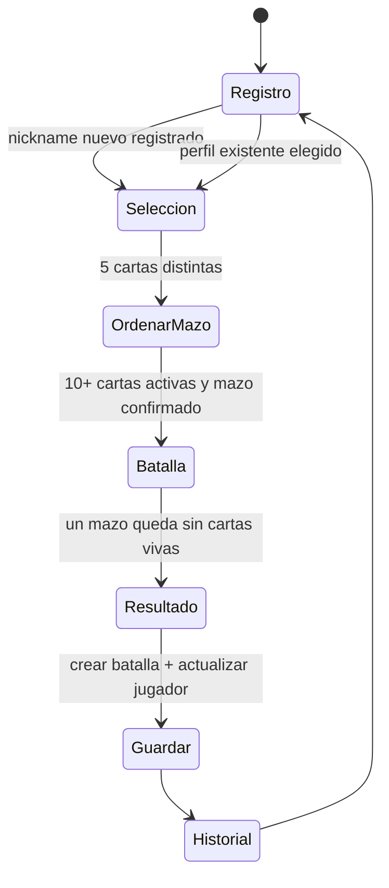

# Plan técnico — Card Battle Arena: Pokémon

**Estado:** listo para implementación, sin código  
**Base:** enunciado del profesor + Documento Maestro v2.0 + Wireframes  
**Equipo:** Manuel y Jose

## 1. Objetivo técnico

Construir un juego web de cartas funcional con **HTML, CSS, JavaScript Vanilla, ES Modules, Web Components y Fetch API**. La aplicación usa una API REST compatible con JSON Server para persistir jugadores, cartas, administradores y batallas.

Tailwind CSS se utilizará únicamente para apoyo visual y responsive. La lógica, el estado, el DOM y los componentes permanecen en JavaScript Vanilla; no se usarán React, Vue, Angular, Svelte, Axios ni SDKs que oculten `fetch()`.

## 2. Decisiones de arquitectura

| Área | Decisión |
|---|---|
| Cliente | Vite + HTML/CSS/JavaScript Vanilla con módulos ES6. |
| UI | Web Components por responsabilidad; Tailwind solo para utilidades visuales. |
| Desarrollo | JSON Server con `src/data/db.json` como API REST local. |
| Producción | Frontend en GitHub Pages y una API REST compatible con la misma estructura de recursos. |
| Configuración | `.env` selecciona URL de development/production mediante `switch` en `apiConfig.js`. |
| Persistencia | Recursos `admins`, `players`, `cards` y `battles`. |
| Lógica | Motor de batalla aislado en `src/utils/battleEngine.js`; no realiza peticiones HTTP ni manipula HTML. |
| Recursos | Imágenes y sonidos dentro de `public/`, referenciados por las cartas en `db.json`. |

## 3. Estructura objetivo del proyecto

```text
card-battle-arena/
├── public/
│   ├── images/cards/
│   ├── sounds/
│   └── favicon.svg
├── src/
│   ├── api/
│   │   ├── apiConfig.js
│   │   ├── adminsApi.js
│   │   ├── playersApi.js
│   │   ├── cardsApi.js
│   │   └── battlesApi.js
│   ├── components/
│   │   ├── app/gameApp.js
│   │   ├── auth/playerRegister.js
│   │   ├── auth/adminLogin.js
│   │   ├── cards/cards.js
│   │   ├── cards/createCards.js
│   │   ├── cards/editCards.js
│   │   ├── cards/deleteCards.js
│   │   ├── deck/deckSelector.js
│   │   ├── battle/battle.js
│   │   ├── battle/battleCard.js
│   │   ├── battle/battleControls.js
│   │   ├── leaderboard/leaderboard.js
│   │   └── history/matchHistory.js
│   ├── data/db.json
│   ├── utils/
│   │   ├── battleEngine.js
│   │   ├── typeChartGen1.js
│   │   ├── random.js
│   │   ├── validators.js
│   │   └── audio.js
│   └── app.js
├── .env
├── .env.example
├── .gitignore
├── index.html
├── package.json
└── README.md
```

`index.html` contiene únicamente el elemento raíz y la carga de `src/app.js`. `app.js` registra/importa componentes; no concentra lógica de juego.

## 4. Modelo de datos

### 4.1 `admins`

| Campo | Tipo | Regla |
|---|---|---|
| `id` | string | Único. |
| `username` | string | Credencial precargada. |
| `password` | string | Credencial académica precargada; no es seguridad de producción. |

### 4.2 `players`

| Campo | Tipo | Regla |
|---|---|---|
| `id` | string | Único. |
| `nickname` | string | Obligatorio y único; se verifica por API antes de crear. |
| `points` | number | Acumulado; inicia en 0. |
| `wins` | number | Acumulado; inicia en 0. |
| `losses` | number | Acumulado; inicia en 0. |
| `gamesPlayed` | number | Acumulado; inicia en 0. |
| `createdAt` | ISO string | Fecha de creación. |

### 4.3 `cards`

Cada carta tiene como mínimo `id`, `name`, `type`, `image`, `description`, `hp: 250`, cuatro ataques, defensa, especial, sonidos, `active` y `createdAt`.

Reglas adicionales de Pokémon del equipo:

- Se precargan exactamente 20 cartas para la entrega; puede existir un catálogo ampliado como decisión posterior, pero no es requisito base.
- Cada ataque tiene `id`, `name`, `baseDamage` y, para la variante Pokémon del equipo, `type`.
- Daños normales de referencia: 20, 30, 40 y 50. Cada carta conserva cuatro ataques equilibrados.
- Defensa: `damageReduction: 0.5`.
- Especial: `baseDamage` entre 55 y 70, `unlockTurn: 2`, `cooldown: 3`; para la propuesta actual se usará 70 siempre que sea mayor que los ataques normales de la carta.
- `sounds` referencia ataque, defensa, especial y derrota. Los sonidos de victoria/derrota globales pueden ubicarse en `public/sounds/`.

### 4.4 `battles`

| Campo | Tipo | Regla |
|---|---|---|
| `id` | string | Único. |
| `playerId` / `playerNickname` | string | Vinculan el registro con su jugador. |
| `result` | `win` o `loss` | Resultado final. |
| `pointsAwarded` | number | 50 por victoria o 10 por derrota. |
| `playerDeck` / `machineDeck` | string[] | Cinco IDs, en orden de combate. |
| `startedAt` / `endedAt` | ISO string | Inicio y fin de la batalla. |

## 5. Contrato REST y Fetch API

Las funciones de `src/api/` son la única capa que llama a `fetch()`. Los componentes y el motor de batalla usan esas funciones, nunca URLs directas.

| Recurso / llamada | Método | Uso |
|---|---|---|
| `/cards` | `GET` | Listar cartas; filtrar activas para selección. |
| `/cards/:id` | `GET` | Consultar carta individual para administración. |
| `/cards` | `POST` | Crear carta desde administración. |
| `/cards/:id` | `PUT` | Reemplazar completamente una carta desde administración. |
| `/cards/:id` | `PATCH` | Actualizar parcialmente, por ejemplo `active`. |
| `/cards/:id` | `DELETE` | Eliminar carta desde administración. |
| `/players?nickname=:nickname` | `GET` | Verificar duplicado de nickname. |
| `/players` | `POST` | Registrar jugador nuevo. |
| `/players/:id` | `PATCH` | Actualizar puntos, victorias, derrotas y partidas jugadas al terminar. |
| `/battles` | `POST` | Guardar historial de una partida terminada. |
| `/battles?playerId=:id` | `GET` | Consultar historial de un jugador. |
| `/players?_sort=points&_order=desc` | `GET` | Obtener base del leaderboard. |
| `/admins?username=:user&password=:password` | `GET` | Validar login administrativo académico. |

### Convenciones de respuesta y errores

- JSON Server devuelve recursos planos; el cliente trabajará con esa forma de respuesta para no añadir una capa artificial.
- Éxito esperado: `200` en lectura/actualización, `201` al crear y `204` al eliminar.
- Nickname duplicado: el cliente detecta respuesta no vacía de la consulta previa y no hace `POST`; muestra error claro.
- Formulario inválido, red caída o respuesta no exitosa: se muestra estado de error y no se actualiza la UI como si la operación hubiera sido exitosa.
- Carga: pool, leaderboard, historial y administración deben tener estados visibles de carga, vacío y error.

## 6. Estados y flujo de juego



### Reglas que debe aplicar `battleEngine`

1. Sortear el primer turno y alternar actor después de cada acción.
2. Mantener HP de cada carta durante toda la batalla; la vencedora no se cura.
3. Aplicar cuatro ataques normales con variación aleatoria 0.85–1.15 y redondeo entero.
4. Aplicar defensa al siguiente daño recibido y consumirla después de recibirlo.
5. Desbloquear especial en el segundo turno propio de la carta; después de usarlo, decrementa cooldown en turnos propios hasta cero.
6. Impedir acciones bloqueadas del jugador y de la máquina.
7. Elegir para la máquina una acción válida; no necesita IA real. La variante de equipo limita su selección a las 15 cartas no usadas por jugador y evita counter directo.
8. Cuando una carta llega a 0 HP, introducir automáticamente el siguiente elemento vivo en el orden del mazo.
9. Finalizar al perder las cinco cartas de un lado, asignar +50/+10 y producir el registro persistible.

## 7. Componentes y responsabilidades

| Componente | Responsabilidad |
|---|---|
| `gameApp` | Enrutamiento simple de pantallas y estado de sesión local. |
| `playerRegister` | Consulta alias, previene duplicados y crea jugador. |
| `deckSelector` | Pool activo, contador 0–5 y orden de mazo con controles funcionales/Drag & Drop. |
| `battle` | Orquesta vista + motor; inicia/termina turnos y persistencia final. |
| `battleCard` | HP, tipos, defensa, especial, KO y animaciones de una carta activa. |
| `battleControls` | Cuatro ataques, defensa y especial; bloquea controles inválidos. |
| `leaderboard` | Ranking y Top 3 destacado. |
| `matchHistory` | Historial persistido por jugador. |
| `adminLogin` | Valida credenciales contra API y habilita administración. |
| `cards` | Lista administrativa y composición de crear/editar/eliminar. |
| `createCards`, `editCards`, `deleteCards` | Operaciones administrativas separadas para demostrar POST, PUT/PATCH y DELETE. |

## 8. Animación, audio y accesibilidad

| Evento | Animación CSS | Audio |
|---|---|---|
| Ataque | Desplazamiento breve hacia rival | Sonido de ataque de la carta. |
| Daño | Sacudida y cambio de barra HP | Puede reutilizar sonido de impacto. |
| Defensa | Resplandor/escudo azul | Sonido de defensa. |
| Especial | Resplandor distintivo | Sonido especial. |
| KO | Atenuación/salida | Sonido de derrota. |
| Relevo | Entrada de la siguiente carta | Sonido opcional de entrada. |
| Fin | Estado de victoria/derrota | Sonido global correspondiente. |

- No se bloquea el flujo si el audio no puede reproducirse; el juego sigue siendo funcional.
- Botones, etiquetas de tipo, HP, cooldown y defensa comunican estado con texto e iconos además de color.
- Drag & Drop debe tener alternativa con controles de posición.

## 9. Plan de trabajo por etapas

| Etapa | Entregable verificable | Dependencia |
|---|---|---|
| 0. Base | Repositorio, Vite, Tailwind, `.env.example`, JSON Server y `db.json` con 20 cartas. | Ninguna |
| 1. API y validación | Módulos Fetch; registro de nickname único; login admin. | Etapa 0 |
| 2. Administración | CRUD visual de cartas con GET/POST/PUT/PATCH/DELETE y estados de error. | Etapa 1 |
| 3. Mazo | Pool de activas, selección de cinco distintas y orden funcional. | Etapa 1 |
| 4. Motor | Pruebas manuales de turnos, daño, defensa, especial, KO y fin. | Etapa 0 |
| 5. Batalla | Arena, bot, animaciones y audio conectados al motor. | Etapas 3 y 4 |
| 6. Persistencia final | Actualización del jugador, batalla guardada, historial y Top 3. | Etapas 1 y 5 |
| 7. Publicación | API de producción, GitHub Pages, README y verificación final. | Etapa 6 |

## 10. División propuesta entre Manuel y Jose

Esta es una división inicial equilibrada; ambos deben revisar e integrar las áreas del otro y realizar commits verificables.

| Responsable inicial | Entregables principales |
|---|---|
| Manuel | `battleEngine`, matriz Gen 1, selección/orden de mazo, bot, arena, controles de combate, animaciones y audio. |
| Jose | `db.json`, módulos `api/`, registro de jugador, login admin, CRUD de cartas, historial, leaderboard, `.env` y despliegue. |
| Ambos | Diseño responsive/Tailwind, integración, pruebas, README, revisión de requisitos y presentación. |

## 11. Casos de prueba obligatorios

- Registro rechaza nickname duplicado y crea nickname nuevo mediante API.
- Con menos de 10 cartas activas, no inicia partida.
- No se puede seleccionar más o menos de cinco cartas ni repetir una.
- El orden visible del mazo coincide con orden de relevo.
- Cada uno de los cuatro ataques genera daño entero con variación permitida.
- Defensa reduce solo el siguiente daño y luego desaparece; puede seleccionarse en turnos seguidos.
- Especial se bloquea al inicio, se habilita en el segundo turno propio y respeta los tres turnos de cooldown.
- La máquina nunca selecciona una acción bloqueada.
- La carta vencedora conserva HP y la derrotada activa el relevo automático.
- Victoria otorga +50; derrota, +10; ambas actualizan contadores y crean un registro de batalla.
- Administración demuestra y verifica GET, POST, PUT, PATCH y DELETE sobre cartas.
- Fallo de red/API muestra un mensaje y no corrompe el estado visible.
- Vista móvil, tablet y desktop mantiene controles accesibles; el Top 3 se distingue visualmente.

## 12. Definition of Done

El proyecto está listo para entrega solo cuando:

- [ ] Las 20 cartas precargadas y sus recursos se cargan correctamente.
- [ ] El flujo completo registro → mazo → batalla → resultado → historial funciona usando Fetch API.
- [ ] Administración protegida demuestra los cinco métodos HTTP sobre cartas.
- [ ] Web Components y módulos están separados por responsabilidad.
- [ ] Animaciones y los seis eventos de audio se disparan desde eventos reales del juego.
- [ ] `.env`, `.env.example`, scripts de desarrollo y README están completos.
- [ ] El frontend está publicado y su URL figura en README.
- [ ] El repositorio y último commit válido se pueden entregar al docente.

