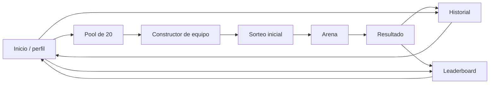

# Wireframes funcionales — Card Battle Arena: Pokémon (v2)

**Estado:** alineados con las decisiones confirmadas del equipo.  
**Propósito:** definir las pantallas, estados e interacciones antes de implementar el frontend.  
**Regla de prioridad:** cuando exista una diferencia con wireframes anteriores, prevalecen el bloque de rectificación del Documento Maestro v2.0 y el Plan Técnico.

## 1. Dirección visual y accesibilidad

- Arena de torneo en obsidiana y grafito, con superficies carbón. La acción usa amarillo eléctrico; el rojo Poké Ball se reserva para acentos y peligro; el verde representa éxito. El azul acero queda limitado a estados de defensa, nunca como color de fondo.
- La interfaz combina una estructura de arena de torneo con detalles retro de Kanto: marcos pixelados sutiles, tipografía de etiquetas monoespaciada y zonas de cartas que recuerdan un tablero táctico. La especificación completa vive en `docs/identidad-visual.md`.
- Las etiquetas de tipo, HP, turno, defensa y cooldown se expresan con texto e iconos; el color nunca es la única señal.
- Escritorio: arena y registro en dos columnas. Móvil: una columna, con acciones en cuadrícula de dos columnas.
- Las cartas son compactas y reutilizables: imagen, nombre, tipo(s), HP y estado de selección/KO.
- El orden del equipo del MVP usa controles visibles de posición. Drag & Drop se incorpora en la segunda etapa y tendrá alternativa mediante botones.

## 2. Navegación



## 3. Pantalla: inicio y perfil

**Objetivo:** crear un alias único o elegir un perfil existente; no es una cuenta de usuario.

```text
┌──────────────────────────────────────────────────────────────┐
│ CARD BATTLE ARENA                         [Historial] [Rank] │
│ Pokémon · Gen 1                                               │
│                                                              │
│              ARENA DE ENTRENADORES                           │
│ Escribe tu alias para continuar                              │
│ [____________________________]                               │
│ [ Continuar / crear perfil ]                                 │
│                                                              │
│ Perfiles existentes                                          │
│ [ MANUEL · 420 pts ] [ JOSE · 260 pts ]                      │
└──────────────────────────────────────────────────────────────┘
```

Estados: alias vacío (acción desactivada), alias duplicado (mensaje de error), solicitud en curso, error de API y lista vacía. El acceso administrativo vive en una ruta o acción separada y solicita usuario y contraseña contra el recurso `admins`.

## 4. Pantalla: pool de 20 y selección

**Objetivo:** elegir cinco Pokémon diferentes entre veinte cartas activas. El catálogo persistido contiene los 151 Pokémon Gen 1 y cada preparación genera un pool de veinte sin duplicados.

```text
┌──────────────────────────────────────────────────────────────┐
│ ← Inicio       ELIGE TU EQUIPO                MANUEL · 420   │
├──────────────────────────────────────────────────────────────┤
│ Pool: 20 Pokémon · Seleccionados: 0 / 5                       │
├──────────────────────────────────────────────────────────────┤
│ [ #025 Pikachu     ][ #001 Bulbasaur ][ #004 Charmander ]    │
│ [ Eléctrico · 250 ][ Planta · 250    ][ Fuego · 250       ]  │
│ [Detalles]          [Detalles]          [Detalles]            │
│ ...                                                          │
├──────────────────────────────────────────────────────────────┤
│ [ Ir a construir equipo ]                         desactivado │
└──────────────────────────────────────────────────────────────┘
```

- La selección muestra indicador textual y visual; no permite repetidos ni más de cinco.
- “Detalles” abre un modal con tipos, cuatro ataques y especial sin perder la selección actual.
- La transición al constructor exige exactamente cinco cartas.

> **Segunda etapa:** se añadirá un reroll único que reemplaza el pool actual por otros veinte Pokémon, previa confirmación y con estado visible de “usado”.

## 5. Pantalla: constructor y orden de combate

**Objetivo:** fijar el orden de los cinco Pokémon, que determina los relevos automáticos.

```text
┌──────────────────────────────────────────────────────────────┐
│ ← Pool                  CONSTRUYE TU EQUIPO          5 / 5   │
├──────────────────────────────────────────────────────────────┤
│ ORDEN DE COMBATE                                              │
│ 1 [Pikachu]  2 [Bulbasaur]  3 [Snorlax]  4 [...]  5 [...]    │
│    [←] [→]     [←] [→]        [←] [→]                        │
│ Usa los controles de posición para ordenar el equipo.        │
├──────────────────────────────────────────────────────────────┤
│ [ Confirmar equipo ]                                         │
└──────────────────────────────────────────────────────────────┘
```

- Antes de confirmar se advierte que el orden no se podrá cambiar y que el bot formará su equipo desde las quince restantes.

> **Segunda etapa:** se incorporarán Drag & Drop y un cambio único entre una carta del equipo y una de las quince restantes. El cambio quedará marcado como usado.

## 6. Pantalla: sorteo y preparación de batalla

**Objetivo:** confirmar ambos equipos y comunicar el primer turno.

```text
┌──────────────────────────────────────────────────────────────┐
│                         EQUIPO LISTO                         │
│ MANUEL                         BOT                           │
│ [Pika] [Bulba] [Snorlax] ...   [?] [?] [?] [?] [?]           │
│ El bot selecciona cinco cartas válidas de las 15 restantes.  │
│                                                              │
│ [ Iniciar sorteo ]   3 ... 2 ... 1 ...  ¡BOT COMIENZA!       │
│ [ Entrar a la arena ] [ Saltar animación ]                   │
└──────────────────────────────────────────────────────────────┘
```

El bot revela sus cartas al entrar en combate. Forma un equipo equilibrado por cobertura de tipos entre las quince cartas restantes, sin elegir counters directos contra el equipo del jugador, y elige una acción válida para su estado.

## 7. Pantalla: arena de batalla

**Objetivo:** ejecutar una acción válida por turno y explicar cada resolución.

```text
┌────────────────────────────────────────────────────────────────────────┐
│ MANUEL · Turno 3                                   TURNO: MANUEL        │
├──────────────────────────────────────┬─────────────────────────────────┤
│                ARENA                 │ REGISTRO DE BATALLA             │
│  ┌────────────────┐                  │ T2 Bot usó Placaje: 28 daño    │
│  │ BOT · MISTERY  │                  │ T3 Tu defensa está activa      │
│  │ HP 162 / 250   │                  │ Equipo rival: [M] [?] [?] ...  │
│  │ ███████░░░░    │                  │ Tu equipo: [P] [B] [S] ...     │
│  └────────────────┘                  │ activo ↑ · KO: atenuado        │
│                 ⚡                    │                                 │
│  ┌────────────────┐                  │                                 │
│  │ TU · PIKACHU   │                  │                                 │
│  │ HP 180 / 250   │                  │                                 │
│  │ Defensa: —     │                  │                                 │
│  │ Especial: listo│                  │                                 │
│  └────────────────┘                  │                                 │
├──────────────────────────────────────┴─────────────────────────────────┤
│ [Ataque 1 · 20] [Ataque 2 · 30] [Ataque 3 · 40] [Ataque 4 · 50]       │
│ [Defensa]                         [Especial · 70]                      │
└────────────────────────────────────────────────────────────────────────┘
```

- Fuera del turno del jugador, los controles se bloquean y aparece “El bot está pensando…”.
- Los ataques aplican variación 0.85–1.15, efectividad Gen 1 y redondeo entero. El registro muestra el daño y modificadores aplicados.
- Defensa reduce un 50 % el siguiente daño recibido; se consume tras recibir daño positivo y no se acumula.
- Especial: el botón explica el bloqueo o cooldown. Está disponible desde el segundo turno propio, y tras usarlo queda bloqueado durante tres turnos propios.
- Al llegar a 0 HP, se muestra KO, se reproduce la animación y entra automáticamente el siguiente Pokémon vivo respetando el orden.
- La carta vencedora mantiene su HP; la batalla finaliza cuando un equipo no tiene Pokémon vivos.

## 8. Pantalla: resultado y guardado

**Objetivo:** informar el resultado obligatorio y persistirlo correctamente.

```text
┌──────────────────────────────────────────────────────────────┐
│                         ¡VICTORIA!                            │
│ Puntos obtenidos: +50                                        │
│ Registro: guardando…                                         │
│ [ Jugar de nuevo ] [ Ver historial ] [ Ver leaderboard ]     │
└──────────────────────────────────────────────────────────────┘
```

- Victoria: +50 puntos; derrota: +10 puntos.
- Al guardar con éxito se actualizan puntos, victorias/derrotas, partidas jugadas y se crea el registro de batalla.
- Si falla alguna operación, se muestra “No se pudo guardar” y “Reintentar guardar”; nunca se presenta el registro como persistido antes del éxito.

## 9. Pantalla: historial y leaderboard

```text
┌──────────────────────────────────────────────────────────────┐
│ ← Inicio              HISTORIAL Y RANKING                    │
├───────────────────────────────┬──────────────────────────────┤
│ HISTORIAL DE MANUEL           │ LEADERBOARD                  │
│ [Victoria] 14 ago · +50 pts   │ 1. MANUEL       420 pts      │
│ Equipo: Pikachu, Bulbasaur…   │ 2. JOSE         260 pts      │
│                               │ 3. MISTY        180 pts      │
│ [Derrota] 13 ago · +10 pts    │                              │
└───────────────────────────────┴──────────────────────────────┘
```

El historial es de solo consulta para las batallas; muestra fecha, resultado, puntos y ambos equipos. El ranking ordena por puntos, con desempate por victorias y después partida más reciente. En móvil, se presentan en secciones consecutivas o pestañas.

## 10. Administración de cartas

**Objetivo:** demostrar GET, POST, PUT, PATCH y DELETE mediante Fetch API tras iniciar sesión administrativa.

```text
┌──────────────────────────────────────────────────────────────┐
│ ADMINISTRACIÓN DE CARTAS                      [Cerrar sesión]│
│ [ Crear carta ] [ Buscar / filtrar ]                          │
│ #001 Bulbasaur  Activa  [Editar] [Activar/desactivar] [Borrar]│
│ #004 Charmander Activa  [Editar] [Activar/desactivar] [Borrar]│
└──────────────────────────────────────────────────────────────┘
```

La interfaz distingue carga, lista vacía, éxito y error. Crear usa POST; editar el recurso completo usa PUT; activar/desactivar usa PATCH; eliminar pide confirmación y usa DELETE.

## 11. Componentes visuales previstos

| Componente | Responsabilidad |
|---|---|
| `game-app`, `app-header` | Navegación y sesión local. |
| `player-register`, `admin-login` | Formularios y mensajes de estado. |
| `pokemon-card`, `pokemon-detail`, `pool-grid` | Presentación y selección de cartas. |
| `team-builder` | Orden accesible mediante botones en el MVP; Drag & Drop y cambio único en segunda etapa. |
| `battle-arena`, `battle-card`, `battle-controls`, `battle-log` | Visualización e interacción de batalla. |
| `score-summary` | Resultado y estado de persistencia. |
| `match-history`, `leaderboard-view` | Consultas persistidas. |
| `cards`, `create-cards`, `edit-cards`, `delete-cards` | Administración protegida. |

## 12. Criterios de aceptación de UX

- El turno, los Pokémon activos, el HP y las acciones permitidas se entienden de inmediato.
- Ninguna acción bloqueada aparenta estar disponible.
- El orden del equipo es visible antes y durante la batalla y coincide con los relevos.
- La interfaz explica efectividad, inmunidad, defensa, especial, KO y guardado sin depender de consola.
- Todas las interacciones principales se pueden completar sin Drag & Drop ni depender solo del color.
- Pool, historial, ranking y administración tienen estados de carga, vacío y error.

## 13. Alcance por etapa

| Etapa | Funcionalidad |
|---|---|
| MVP | Catálogo de 151, pool aleatorio de 20, selección de cinco, orden con botones, bot con cobertura de tipos, combate, persistencia, historial, ranking y CRUD de cartas. |
| Segunda etapa | Reroll único, cambio único de carta y Drag & Drop con alternativa accesible. |

## 14. Origen y persistencia del catálogo

- PokeAPI se utiliza una sola vez durante la preparación de datos para obtener los 151 Pokémon Gen 1, sus tipos, movimientos de referencia, sprites y gritos específicos.
- Un script de siembra genera el catálogo local y descarga los recursos a `public/`; cada carta conserva sus rutas locales en `db.json`.
- Para cada Pokémon, el script considera los movimientos ofensivos que aprende por nivel en Pokémon Rojo/Azul hasta nivel 50. Asigna cuatro movimientos normales aleatorios y sin repetir; el especial es el movimiento ofensivo distinto con mayor poder oficial disponible.
- Si el Pokémon no reúne cinco movimientos ofensivos distintos hasta nivel 50, el script continúa considerando sus movimientos aprendidos por nivel posteriores hasta completar los cinco. No se usan MT/MO.
- Los daños de Card Battle Arena no copian el poder oficial: los cuatro movimientos normales reciben 20, 30, 40 y 50; el especial recibe 70.
- Durante la ejecución, la aplicación no consulta PokeAPI: lee y escribe mediante la API REST local compatible con JSON Server.
- La API local conserva los recursos `admins`, `players`, `cards` y `battles`; solo `cards` dispone del CRUD administrativo completo.
